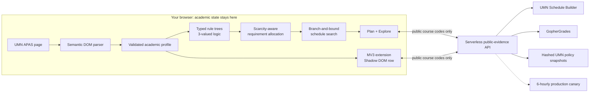

<div align="center">

# Smart UMN Planner

### Your degree audit, your next semester, one plan you can explain.

An APAS-aware course planner and Chrome extension for **University of Minnesota Twin Cities** students.
It reads the degree audit you already have, finds the courses that actually move you forward, builds a conflict-free week, and brings course intelligence straight into UMN Schedule Builder.

**[▶ Try the demo student](https://smartumn.qinyangtan.com/?demo=1)** · **[Download the Chrome extension](https://smartumn.qinyangtan.com/smart-umn-extension.zip)** · **[3-minute test drive](#try-it-in-3-minutes-no-umn-account-needed)** · **[Under the hood](#under-the-hood)**

`Live in production` · `Browser-local academic data` · `Symbolic rule engine: AI explains, never decides` · `WCAG 2.2 AA tested` · `Monitored every 6 hours`


</div>

## Try it in 3 minutes (no UMN account needed)

APAS lives behind UMN login, so the planner includes a **demo student**: a clearly labeled synthetic Computer Science audit. It runs through the *same* parser, rule engine and scheduler as a real audit. Nothing is uploaded; the demo lives only in your browser. Use desktop Chrome.

**Step 1 — Install the extension (optional, 30 seconds).** Download **[smart-umn-extension.zip](https://smartumn.qinyangtan.com/smart-umn-extension.zip)** and unzip it. Open `chrome://extensions`, turn on **Developer mode**, click **Load unpacked**, and pick the unzipped folder. Chrome Web Store publication is pending; this ZIP is the same reviewed build. You can skip this step to try the Web app only.

**Step 2 — Load the demo student.** Open **[smartumn.qinyangtan.com/?demo=1](https://smartumn.qinyangtan.com/?demo=1)**. You should see:
- a gold **Demo student** banner;
- **54 credits left**, with 62 of 120 completed including AP calculus credit;
- a graduation horizon;
- review items that Smart UMN refuses to decide automatically: a residency-credit policy, and a research-credit rule that needs advisor approval.

**Step 3 — Build a plan.** Click **Build my plan**. Smart UMN matches live Spring 2027 offerings to the remaining requirements, checks prerequisites against the demo transcript, and searches section combinations. You get conflict-free options (for example CSCI 2041 + STAT 3021 + CSCI 5302, 10 credits), **Why this plan?**, class numbers, and a map of which requirement each course fills.

**Step 4 — Explore a course.** Switch to **Explore**, search `CSCI 5302`, and open **Optional course experience evidence** to see instructor-specific and course-wide grade history.

**Step 5 — See it inside UMN Schedule Builder** (needs Step 1). These are public UMN pages; no login needed:

| Open | What to look for |
|---|---|
| [CSCI 4041 — Algorithms](https://schedulebuilder.umn.edu/explore/2027Spring/CSCI/4041/) | **APAS FIT ✓ Upper-division computer science core · Prerequisites satisfied**, personalized from the demo transcript |
| [CSCI 5302 — Numerical Algorithms](https://schedulebuilder.umn.edu/explore/2027Spring/CSCI/5302/) | Grade history with its trend, professor context and a reviewed Reddit thread. Click any cell to expand it |
| [PSY 1001 — Intro Psychology](https://schedulebuilder.umn.edu/explore/2027Spring/PSY/1001/) | **✓ Social sciences core**, but its extra prerequisite condition is flagged **Needs review** instead of being assumed away. Also large-sample grade history (19,704 students) |

Click **Full planner ↗** on any row to jump back to the Web app with that course open. When you're done, **Exit demo** in the banner removes it. The demo never overwrites a real student's APAS already stored in the browser.

## The problem

Planning a UMN semester means juggling four tools and four questions:

1. **APAS:** does this course count toward my degree?
2. **Prerequisites:** am I allowed to take it yet?
3. **Schedule Builder:** does the week actually work?
4. **Word of mouth:** what are the course and the instructor like?

Students answer these by hand, across tabs, every semester. A mistake costs a wasted seat, a delayed graduation, or a surprise in week three.

## What Smart UMN does

| | Highlight | Why it matters |
|---|---|---|
| 🎯 | **Starts from your real APAS audit** | Explore courses through your own remaining requirements, not a generic catalog. |
| 🧮 | **Symbolic degree engine with an honest “unknown”** | Every rule is evaluated as **yes / no / unknown**. Anything uncertain stays visibly review-only instead of becoming a confident guess. |
| 🗓️ | **One-click conflict-free schedules** | Live sections, linked lectures/labs, meeting conflicts and credit limits are searched automatically. Every option explains *why this plan*. |
| 🧭 | **Lives where you already work** | The Chrome extension adds APAS fit, grade history, professor context, student voices and offering history **inside** UMN Schedule Builder. |
| 🔒 | **Your data never leaves your browser** | No accounts and no student database. The server only ever sees public course codes. |
| ♿ | **Built for everyone** | Keyboard-operable core flows, visible focus, 320 px reflow and reduced-motion support, tested against WCAG 2.2 AA on every release. |

## See it work

### 1. From APAS to a plan you can explain


Import your audit and choose what matters this semester: degree progress, a lighter load, or a cautious grade-history comparison. Smart UMN discovers current courses that match your **remaining** requirements, verifies prerequisites, and searches section combinations. You get a week with a plain-language **Why this plan?**, the class numbers ready to register, and a map of which APAS requirement each course fills.

*Recorded on the live site with a clearly synthetic audit. No real student data is used anywhere in this README.*

### 2. Course intelligence inside Schedule Builder


No new tab and no copy-paste. On any Twin Cities course page, the extension adds one compact row: **APAS fit · grade history · professor · student voices · offering history**. Expand any cell for full grade distributions, GPA trends, the current instructor's own history, and reviewed Reddit discussion, each linked to its original source. **Full planner ↗** carries the course, term and campus straight into the Web app.

### 3. Explore any course with evidence, not vibes


Look up any course to see how it relates to your APAS plan, then open the optional evidence: instructor-specific and course-wide grade distributions from GopherGrades, clearly separated from anything official.

### 4. Keyboard-first, everywhere


Tab and Enter work through the Web app and the injected Schedule Builder row. The two-tone maroon/gold focus ring stays visible on both white and maroon surfaces, and dialogs return focus where you left it.

## Why it's different

### AI can explain, but it never decides

Many “smart” planners let a language model guess whether a course counts. Smart UMN doesn't. Degree decisions come from a **symbolic rule engine**: APAS requirements are parsed into typed rule trees and evaluated with three-valued (Kleene) logic. When evidence is missing, the answer is **unknown**, and the planner says so. An incomplete audit gets “Not enough evidence” instead of a made-up graduation date.

Semantic retrieval is used where it is safe: to **explain** ambiguous policy text with official UMN sources. Every retrieval response carries `decisionAuthority: "none"`. It can point you to the right policy. It cannot approve a prerequisite, grant credit or declare a degree complete.

### Privacy by architecture, not by promise

There is no student-profile database to breach. The parsed audit, preferences and saved plans live in your browser. The public API accepts only course codes, term, campus and a bounded review-only policy phrase, and it rejects everything else. Passwords, Duo codes, cookies and raw audit HTML never leave the page. [Privacy policy](https://smartumn.qinyangtan.com/privacy.html) · [Data & source governance](docs/GOVERNANCE.md)

### Every claim is traceable

Current offerings come from UMN Schedule Builder, historical grades from GopherGrades, and policy snapshots from policy.umn.edu (content-hashed and dated). Reddit and RateMyProfessors context is attributed and linked. Nothing is secretly scored: schedules are ranked only by APAS coverage, prerequisites, availability and the preferences **you** chose.

## Under the hood



| Technique | What we built |
|---|---|
| **Semantic DOM parsing** | APAS has no public API. The extension reads the rendered audit in the student's own session and turns sub-requirements, course pools, credit/count rules, test and transfer credit, and in-progress work into a validated profile. Unfamiliar structures fail closed instead of being guessed. |
| **Typed rule trees + three-valued logic** | Requirements compile to an AST (`course`, `range`, `attribute`, `exclude`, `anyOf`, `allOf`, `credits`, `count`, `gpa`, `policy`, `unknown`) evaluated with Kleene yes/no/unknown semantics, so uncertainty propagates honestly. |
| **Constraint-satisfaction scheduling** | A bounded branch-and-bound search (25k-node budget) over real section bundles prunes on credit limits, meeting conflicts, stale availability and unproven prerequisites, then ranks results by degree coverage and your preferences. |
| **Scarcity-aware allocation** | A most-constrained-first heuristic (the MRV idea from CSP solvers) assigns each planned course to the requirement that needs it most, so no course is double-counted. |
| **Hybrid policy retrieval** | TF-IDF-style lexical scoring with phrase matching, plus optional **on-device** MiniLM-L6-v2 embeddings (ONNX, 4-bit quantized, via transformers.js) for semantic reranking on self-hosted instances. The serverless production path is lexical-only by design. Snapshots are scope-filtered, SHA-256 hashed and expire after 7 days. |
| **Manifest V3 + Shadow DOM** | The extension injects UI into a third-party page without style collisions. It holds only `storage` and `alarms` permissions and three exact hosts, and runs no remote code. |
| **Local-first sync** | The extension and the Web app share academic state through an origin-checked bridge in the same browser. No accounts and no server copy. |
| **Operational rigor** | Byte-reproducible extension builds (pure-JS PNG encoding for cross-platform determinism), SHA-pinned CI actions, and a 6-hourly canary that tells an upstream **outage** apart from a **schema change** and opens an issue automatically. |
| **Accessibility engineering** | axe-core WCAG 2.2 AA scans plus scripted keyboard, dialog-focus, 320 px reflow and reduced-motion checks against the live site and the exact published extension. |

**Stack:** TypeScript · Node.js 24 · Netlify Functions · in-memory SQLite (`node:sqlite`) · esbuild · Motion · transformers.js (optional) · Playwright + axe-core · GitHub Actions.

## By the numbers

- **200** automated tests, zero failures, run in CI on every change.
- **22** production health checks every 6 hours: TLS, headers, API, data contracts, policy freshness, security and package integrity.
- **0** axe-core violations across 15 scans of the live Web and extension UI.
- **0** student records stored on any server.
- **2** permissions (`storage`, `alarms`) and **3** exact hosts. No all-sites access.

## Use it now

1. **[Open Smart UMN](https://smartumn.qinyangtan.com)** in Chrome. Public course exploration works immediately, and **[the demo student](https://smartumn.qinyangtan.com/?demo=1)** works without a UMN account.
2. **[Download the extension ZIP](https://smartumn.qinyangtan.com/smart-umn-extension.zip)** and unzip it. Then open `chrome://extensions`, enable **Developer mode**, choose **Load unpacked**, and select the folder that contains `manifest.json`.
3. In the planner, choose **Connect APAS**. Sign-in and Duo happen only on official UMN pages.
4. Build your plan, then register in UMN's official systems.

**Distribution status:** the v0.10.9 production ZIP is publicly downloadable. Chrome Web Store publication is pending, so there is no one-click store install yet. Managed browsers may block unpacked extensions.

[Support](https://smartumn.qinyangtan.com/support.html) · [Privacy](https://smartumn.qinyangtan.com/privacy.html) · [Known limitations](docs/LIMITATIONS.md) · [More demos](docs/DEMOS.md)

## Honest boundaries

- **Twin Cities only.** Historical grade data (GopherGrades) is Twin Cities-scoped, so the product is too.
- **Broad but not universal APAS support.** Structural checks cover the official Twin Cities program inventory, but that is not proof that every real audit is fully supported. See [compatibility coverage](docs/APAS_COMPATIBILITY_COVERAGE.md).
- **A planning aid, not an authority.** Plans do not guarantee course applicability, registration, grades or graduation. APAS, advisors and UMN systems remain authoritative.

<details>
<summary>Earlier animated walkthrough (historical UI)</summary>


This recording uses synthetic academic data and predates the current release. Use the demos above to evaluate today's product.

</details>

## Build locally

Requires Node.js 24+ and Chrome.

```sh
npm ci
npm run build
npm start          # http://127.0.0.1:4317/ — load dist/extension in chrome://extensions
```

```sh
npm test
npm run typecheck
NODE_ENV=production PUBLIC_ORIGIN=https://smartumn.qinyangtan.com npm run package:extension
npm run verify:release -- --production
npm run verify:production          # canonical production canary
```

[Architecture](docs/ARCHITECTURE.md) · [Deployment](docs/DEPLOYMENT.md) · [Operations](docs/OPERATIONS.md) · [Governance](docs/GOVERNANCE.md) · [Policy retrieval](docs/SEMANTIC_POLICY_RETRIEVAL.md) · [Verification](docs/VERIFICATION.md) · [Contributing](docs/CONTRIBUTING.md)

---

Smart UMN is an independent student project, not affiliated with or endorsed by the University of Minnesota. APAS and official UMN systems remain authoritative.
