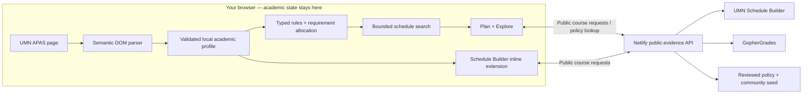

<div align="center">

# Smart UMN Planner

### Your degree requirements. Your next semester. One clearer plan.

APAS-aware course planning and in-page course intelligence for **University of Minnesota Twin Cities**.

**[Open the planner](https://smartumn.qinyangtan.com)** · **[Download the Chrome extension](https://smartumn.qinyangtan.com/smart-umn-extension.zip)** · **[See it in action](#see-it-in-action)**

Browser-local academic data · Deterministic planning · Live public course evidence

</div>

Choosing classes means connecting several different questions: *Does this count toward my degree? Can I take it yet? Does the schedule work? What do we know about the course and instructor?*

Smart UMN brings those questions together. Import your APAS, explore courses through your own remaining requirements, and build schedule options with explanations you can inspect. In Schedule Builder, the Chrome extension puts that context directly beside the course you are already viewing.

## Start with your next decision

| What you need | What Smart UMN brings together |
| --- | --- |
| **Know what counts** | Your APAS requirements, articulated transfer/test credit, prerequisite checks and explicit review items. |
| **Find a workable week** | Current sections, linked lectures/labs, meeting conflicts, travel buffers, credit limits and campus-day preferences. |
| **Make the plan yours** | Prioritize degree progress, a lighter useful load, or a cautious historical-grade comparison. Verified academic and scheduling constraints come first. |
| **Understand a course** | Historical grade distributions, term trends, matched current-instructor evidence and observed offering patterns. |
| **Read the human context** | Source-labeled RMP evidence when supplied by GopherGrades, plus reviewed Reddit references. Original sources stay one click away. |
| **Know what to ask an advisor** | Unresolved policies, unsupported rules and missing credit totals remain visible instead of becoming confident guesses. |

**Two destinations: Plan and Explore.** A focused starting point, with detailed evidence and preferences available when you need them.

## See it in action

### Course intelligence, where you already choose classes


The extension adds a compact inline row inside Schedule Builder: APAS fit, grade history, professor context, student voices and offering history. Expand the evidence without leaving the course. Open the full planner with the course, semester and campus carried across automatically.

*Current v0.10.4 capture; public course evidence, no student academic profile. Ratings and historical outcomes are context, not predictions.*

### From APAS to a plan you can explain


This deliberately incomplete synthetic audit demonstrates an important behavior: Smart UMN can help plan a semester while saying **“Not enough evidence”** about graduation timing. Missing degree credits never become a made-up completion date.

[Explore the recorded workflow demos](docs/DEMOS.md): registration advice, what-if preferences and expandable course evidence. Earlier recordings are labeled separately from the current production screenshots.

<details>
<summary>Earlier animated walkthrough (historical UI)</summary>


This recording uses synthetic academic data and predates the current release. Use the current screenshots and live site above to evaluate today's product.

</details>

## What makes it different

### Personalized by your audit

Course exploration starts from the student's remaining requirements. The parser recognizes generic APAS structures rather than a hardcoded computer-science checklist. Degree, major, minor and certificate routes can be represented together; an unfamiliar rule stays review-only.

The architecture targets Twin Cities programs broadly. Structural checks against the official program inventory are **not** proof that every real student's audit is fully supported. [Compatibility coverage](docs/APAS_COMPATIBILITY_COVERAGE.md) records the actual evidence and remaining gaps.

### A rule engine with an honest “unknown”

Academic decisions use typed rules and three-valued evaluation: **yes, no, unknown**. The bounded schedule search checks actual section bundles, meeting dates and restrictions. Requirement allocation prevents a planned course from being counted twice within the supported allocation model. Every generated option carries explanations; search limits and unresolved conditions remain explicit.

Policy retrieval helps explain ambiguous requirements. It cannot approve a prerequisite, grant credit or declare a degree complete.

### Evidence you can trace

Current offerings come from UMN Schedule Builder. Historical grades come from GopherGrades. Professor signals are matched to current instructors; missing fields are not invented. Reddit and RateMyProfessors context stays attributed and reviewable, with no hidden community-sentiment score deciding degree fit.

[Source coverage](docs/COURSE_INTELLIGENCE_COVERAGE.md) distinguishes current official courses, historical-grade availability and the much smaller reviewed-community collection.

### Personal planning stays on your device

Normalized APAS records, preferences and saved plans live in browser storage. The hosted API serves public evidence; it has no student-profile database. Course code, term and campus requests—and bounded review-only policy queries—are the network boundary. Passwords, Duo codes, cookies, SAML data and raw authenticated audit HTML are never uploaded to that API.

The Manifest V3 extension uses `storage` and `alarms`, with access restricted to UMN APAS, Schedule Builder and the canonical planner. No `tabs`, cookies or Side Panel permission. [Privacy](https://smartumn.qinyangtan.com/privacy.html)

## How it works



| Layer | Technology and purpose |
| --- | --- |
| **Web & extension** | TypeScript, semantic HTML/CSS, Motion for restrained interaction, Manifest V3 and Shadow DOM to isolate inline UI from Schedule Builder styles. |
| **Academic core** | Typed rule trees, deterministic prerequisite evaluation, supported cross-requirement allocation and bounded section-combination search. |
| **Public API** | Node.js 24 on Netlify Functions, validated provider adapters, bounded requests, timeouts and an ephemeral SQLite cache of refetchable public evidence. |
| **Policy retrieval** | Lightweight lexical retrieval in production, with source scope, content hashes and freshness checks. Optional local MiniLM reranking is isolated from the serverless path and never becomes degree authority. |
| **Build & verification** | esbuild, TypeScript checks, Node's test runner, synthetic browser acceptance, provider canaries and reproducible extension packaging. |

The public site runs independently of the developer's laptop. Personalization does not require a Smart UMN account. Hosting remains subject to provider availability and plan limits.

## Use it now

1. **[Open Smart UMN](https://smartumn.qinyangtan.com)** in Chrome.
2. **[Download the extension ZIP](https://smartumn.qinyangtan.com/smart-umn-extension.zip)** and unzip it. Open `chrome://extensions`, enable **Developer mode**, choose **Load unpacked**, and select the folder containing `manifest.json`.
3. Return to the planner and choose **Connect APAS**. Sign-in and Duo happen only on official UMN pages.
4. Explore your options, build a plan, and review the final enrollment details in UMN's official systems.

**Distribution status:** the production ZIP is publicly downloadable without GitHub access. Chrome Web Store submission/review is still pending; there is no one-click store listing yet. Managed browsers may prohibit unpacked extensions. Public course evidence can be explored without importing an APAS audit; personalized degree fit requires your own authorized audit.

[Support](https://smartumn.qinyangtan.com/support.html) · [Privacy](https://smartumn.qinyangtan.com/privacy.html) · [Known limitations](docs/LIMITATIONS.md)

## Build locally

Requires Node.js 24+ and Chrome, plus repository access.

```sh
npm ci
npm run build
npm start
```

Open `http://127.0.0.1:4317/`. For local extension development, load `dist/extension` in `chrome://extensions`. A local build targets localhost; use the public ZIP to connect to the hosted product.

```sh
npm test
npm run typecheck
NODE_ENV=production PUBLIC_ORIGIN=https://smartumn.qinyangtan.com npm run package:extension
npm run verify:release -- --production
```

[Deployment](docs/DEPLOYMENT.md) · [Architecture](docs/ARCHITECTURE.md) · [Policy retrieval](docs/SEMANTIC_POLICY_RETRIEVAL.md) · [Verification](docs/VERIFICATION.md) · [Contributing](docs/CONTRIBUTING.md)

---

Smart UMN is an independent student tool, not affiliated with or endorsed by the University of Minnesota. APAS and official UMN systems remain authoritative. Plans, historical outcomes and graduation estimates do not guarantee course applicability, enrollment, grades or graduation.
