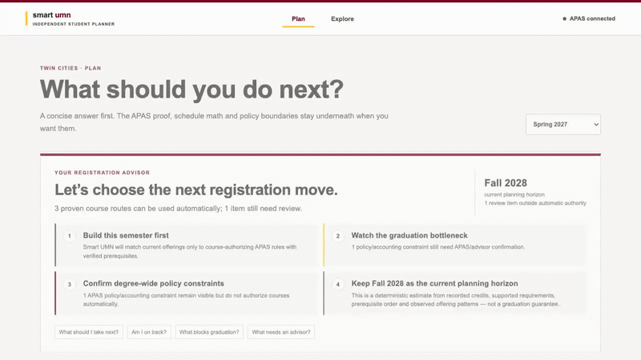
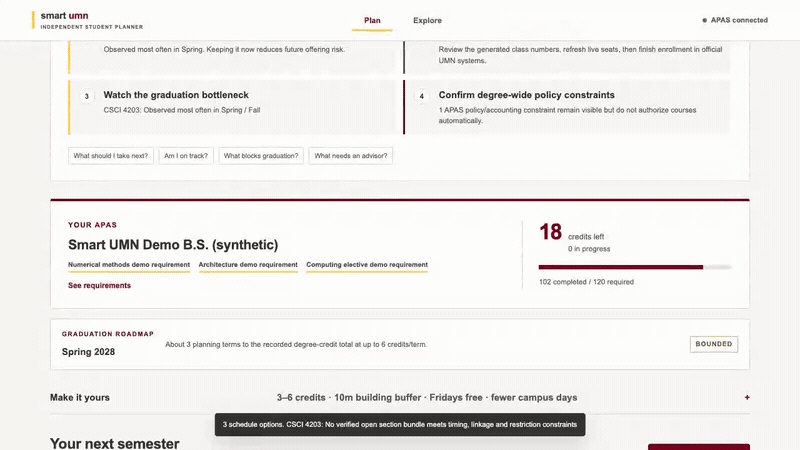
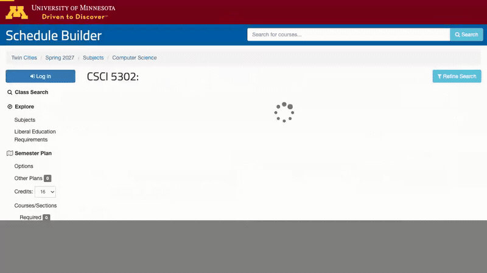

# Smart UMN Planner

**A local-first registration advisor and Schedule Builder course-intelligence layer for University of Minnesota Twin Cities students.**

Smart UMN turns your APAS into practical course-planning decisions. The Web answers **what should I take next?**; the Chrome Extension adds the information Schedule Builder does not show next to the course itself.

**Live Web:** https://smart-umn-planner.netlify.app — hosted on Netlify Free; normalized academic state and saved plans remain local to the student's browser.


*All demos use a synthetic academic profile. Course/grade evidence shown in the Extension may come from current public UMN and GopherGrades data.*

## What it does

- **Registration Advisor** — turns remaining APAS requirements into next-semester recommendations, registration-ready schedules, graduation-horizon estimates, bottlenecks, and clear advisor handoffs.
- **Planning goals** — choose degree progress, the lightest useful credit load, or a cautious comparison of course-wide historical grades; degree and scheduling constraints always take priority. See [Planning goals and academic exploration](docs/PLANNING_GOALS.md).
- **Schedule Builder Course Intelligence** — appears directly under the native course description and adds APAS fit, historical grades, GPA trends, current-professor history, RateMyProfessors overall quality when available through GopherGrades, reviewed Reddit context, and historical offering patterns.
- **APAS-aware across programs** — supports generic degree / major / second-major / minor / certificate routes without hardcoding one major.
- **Real scheduling constraints** — checks prerequisites, duplicate/equivalent credit, live sections, meeting conflicts, linked sections, travel buffers, campus-day preferences, waitlist policy, and credit-load preferences.
- **Policy evidence without AI guessing** — review-only APAS language is matched to typed policy families and curated official UMN policy pages with JEV + a lightweight local MiniLM reranker; retrieval never changes the deterministic degree decision.
- **Local-first privacy** — normalized academic state and saved plans stay in the browser; raw authenticated APAS HTML, credentials, Duo/SAML data, and cookies are not sent to the local public-evidence API.

## Demos

### Web — Registration Advisor



The first screen gives the student the next registration decision, planning horizon, bottleneck, and the small set of issues that still need official/advisor review.

[Full-resolution video](docs/demos/01-web-registration-advisor.mp4)

### Web — What-if planning



Credit load, summer terms, program scope, timing, travel, campus-day, waitlist, and drop-course scenarios stay available without turning the main experience into a dashboard.

[Full-resolution video](docs/demos/02-web-what-if-advisor.mp4)

### Chrome Extension — Course Intelligence



Smart UMN is inserted directly into the native Schedule Builder course description area. The default row stays flat and compact; click any metric to expand its evidence without opening a separate side panel.

[Full-resolution video](docs/demos/03-extension-course-intelligence.mp4)

## Run locally

Requires Node.js 24+ and Chrome.

```sh
npm ci
npm run build
npm start
```

Open `http://127.0.0.1:4317/`. Optional semantic policy evidence can be prepared once with `npm run embeddings:warm` and refreshed from curated public UMN policy sources with `npm run policy:refresh`; the planner still works without this layer.

To install the Chrome Extension, open `chrome://extensions`, enable **Developer mode**, choose **Load unpacked**, and select `dist/extension`. Then reload the planner and any open Twin Cities Schedule Builder pages.

## Disclaimer

- **Smart UMN is an independent student tool and is not affiliated with, endorsed by, or an official service of the University of Minnesota.**
- **APAS and official UMN registration systems remain authoritative** for degree progress, course applicability, registration eligibility, graduation requirements, and enrollment.
- Graduation horizons, offering patterns, grade distributions, professor ratings, and community references are planning context, not guarantees or recommendations about academic outcomes.
- RateMyProfessors values are displayed only when an upstream public dataset supplies them for an exact matched instructor; missing rating count, difficulty, would-take-again, or update dates are not invented.
- Reddit excerpts appear only when an original public reference has been explicitly reviewed/imported. Smart UMN does not automatically scrape Reddit or RateMyProfessors.
- Historical grade outcomes describe past cohorts and do not predict an individual student's grade. Optional third-party evidence is not available for every course; see [`docs/COURSE_INTELLIGENCE_COVERAGE.md`](docs/COURSE_INTELLIGENCE_COVERAGE.md) for the current public-source coverage audit.
