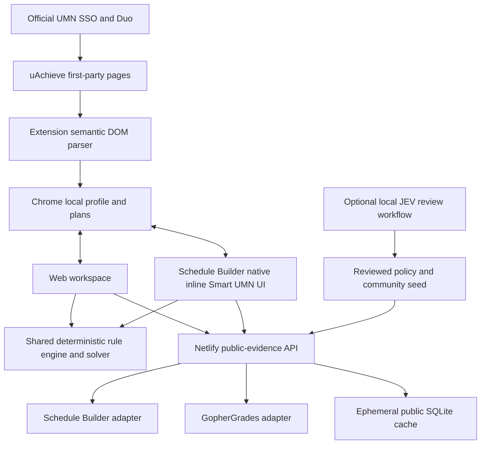

# Architecture

The Web and Chrome extension share TypeScript schemas, parsing, deterministic academic rules and source-labeled presentation. Production serves static Web assets and a Node 24 public-evidence function on Netlify at `https://smartumn.qinyangtan.com`. The function caches refetchable public provider data in ephemeral in-memory SQLite and loads reviewed policy/community evidence from a checked-in seed. Normalized academic profiles, preferences and plans stay browser-local.

The optional long-running Node deployment uses persistent public SQLite for provider snapshots, health, reviewed references and worker jobs. It remains available as a rollback/local-development path; it is not the primary production host. See [Deployment](DEPLOYMENT.md) for the exact current release and topology.

## APAS state machine

Disconnected → Connect creates an owned ordinary uAchieve tab → native UMN authentication, if required → completed-audit list → deterministic primary-program selection or an explicit program picker when ambiguous → semantic audit and same-origin Course History → local normalized state → optional explicit import of additional major/minor/certificate audits → broadcast to planner tabs → close only the owned temporary tab. The extension stores the program name, not an authentication or audit token, as selection preference. Periodic refresh runs every six hours while a profile exists. Discovery has bounded hops and a three-minute acquisition window; reconnect restarts acquisition. A source parser error preserves the prior profile and sets an explicit status.

The extension is not injected into login.umn.edu or Duo. It never reads cookies or network headers. Its first-party fetch uses normal browser-managed authentication without exposing cookie values.

## Parsing and correctness

The first `#audit` is authoritative. Parsing is program-agnostic: primary program titles are not restricted to a degree-abbreviation allowlist, total-degree credits use the semantic APAS `category_Total_Hours` marker when available, and additional imported program requirement IDs are namespaced by their program title. The observed UMN page embeds a second responsive copy. Requirements retain hierarchy, status, attributes and explicit selectable course metadata. Course History is authoritative for individual course records, with normalized campus prefixes and term strings. Failed / unknown courses never satisfy a prerequisite. Explicit course pools with proven count/credit semantics become executable rules; unresolved caps and compound exceptions stay candidate/review-only. Recurring accounting prose such as degree credits, institutional GPA/residency, major-credit totals, scoped designator constraints, qualified official categories and degree-application scope can become typed non-authorizing Policy Rule IR. Cross-requirement allocation or unrecognized prose remains contained rather than guessed.

Requirement interpretation separates strict course routes, candidate routes, aggregate parent containers, typed/unclassified policy constraints, and unresolved nodes. Exact selectable pools with proven count/credit semantics, exact Liberal Education categories, deterministic level patterns, and standalone `<SUBJECT> designator` credit statements can become strict. A designator statement explicitly scoped to credits required by another requirement is accounting-only unless that parent scope can be represented and intersected deterministically; it must not independently authorize every course in the subject. Pools with unresolved caps or qualifiers remain candidate-only. Qualified official categories may gain a current Schedule Builder attribute candidate while preserving the unproven qualifier. Policy Rule IR remains visible/explainable but never authorizes arbitrary courses. The solver uses three-valued logic: yes / no / unknown. Only yes authorizes a course. Unknown OR branches do not defeat an independently proven alternative. Candidate discovery also runs locally: explicit APAS course rules become exact course lookups, while supported subject/range rules request only that public subject's current Schedule Builder catalog and are filtered against the private rule in the browser. The bounded candidate pool is round-robin balanced across the scarcest supported remaining targets instead of taking the first 16 catalog matches. During schedule evaluation, a deterministic scarcity-aware allocator assigns each planned course to at most one deepest supported remaining target; aggregate parent requirements are not simultaneously counted when supported child targets exist. Degree-progress coverage ranks before optional timetable preferences, while APAS remains the final authority for cross-requirement policy. In-progress prerequisites are not treated as completed. Each selected course needs a proven remaining requirement match; sections need known dated meetings, open capacity, satisfied section prerequisites and resolved linkage/restrictions. Community references are not solver inputs.

A schedule proves the supported course eligibility and timing constraints; it does not certify graduation, registration entitlement, minimum-grade completion of a future course or final APAS credit allocation. Explanations explicitly preserve that boundary.

## Reliability

Public requests use per-provider pacing, bounded timeout, one-flight deduplication and schema checks. Current subject discovery uses Schedule Builder's own `courses_wildcard` followed by bounded `courses` bulk lookups; the public API receives a subject code and term, never the APAS rule that caused the lookup. Failed refreshes retain old evidence with the original retrieval timestamp and degraded health. Stale sections cannot enter the solver. The browser refreshes selected public context before generation. Search is bounded to 16 candidates / 25,000 nodes / eight displayed options, and reports truncation.

Community references come from precomputed DB lookup. Browser collection never runs on the course detail request path. JEV uses a distinct named session and only owned tabs on sources with an explicit current `allow` policy. Reddit and RateMyProfessors are currently `link-only`; their original links can be attached to verified course/instructor entities, but the worker will not scrape them. Site access policy, CAPTCHA detection, URL allowlisting and entity evidence precede persistence.

## Anonymous compatibility corpus

Real-audit expansion is deliberately separated from raw student data. `packages/core/compatibility.ts` turns a locally parsed profile into schema-v1 structural counts and a coarse fingerprint that includes rule/policy families but excludes program names, course codes, requirement text, exam names, source institutions and raw HTML. Transfer cohorts are counts only. The checked-in corpus is validated for exact allowed fields and internal accounting invariants; CI rejects stale coverage documentation, duplicate structures, unresolved requirements and unclassified policy constraints. `docs/APAS_COMPATIBILITY_COVERAGE.md` is generated from that corpus and explicitly shows missing real-audit cohorts rather than inferring coverage from the official synthetic identity matrix.

## Public Course Intelligence coverage

Campus-wide public-source coverage is measured separately from product capability. `scripts/report-course-intelligence-coverage.ts` walks the official Twin Cities Schedule Builder subject directory/catalogs through the existing paced provider and intersects current course codes with GopherGrades department records. It writes `docs/evidence/course-intelligence-coverage.json` plus the generated `docs/COURSE_INTELLIGENCE_COVERAGE.md`. The checked-in verifier recalculates all aggregate counts from the subject rows and rejects dashboard drift. This evidence intentionally keeps official current-course metadata, historical grades, and curated community/professor context as separate layers; missing optional evidence degrades visibly instead of being synthesized.

## Deployment boundary

Smart UMN remains local-first for personalized academic state even though the public Web/public-evidence API is hosted. The canonical Netlify deployment serves only public course/policy/community evidence and static Web assets; APAS state and saved plans stay in the student's browser, so no authenticated per-user academic database is introduced. The historical localhost/Cloudflare service is retained only as rollback. Provider governance, privacy/legal review, Chrome Web Store review and broader real-APAS compatibility are still separate production-readiness work and are not silently claimed by the hosting architecture.
