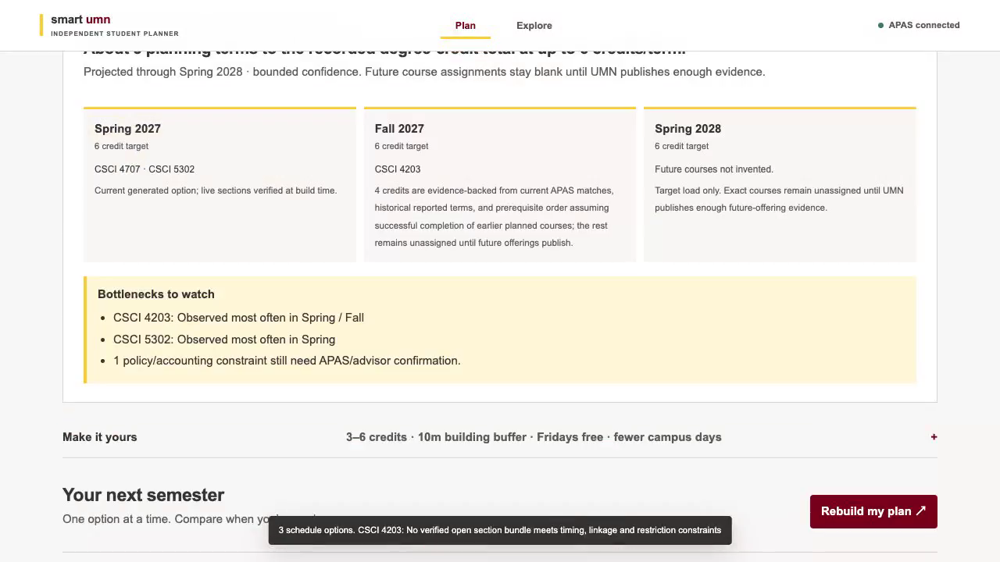
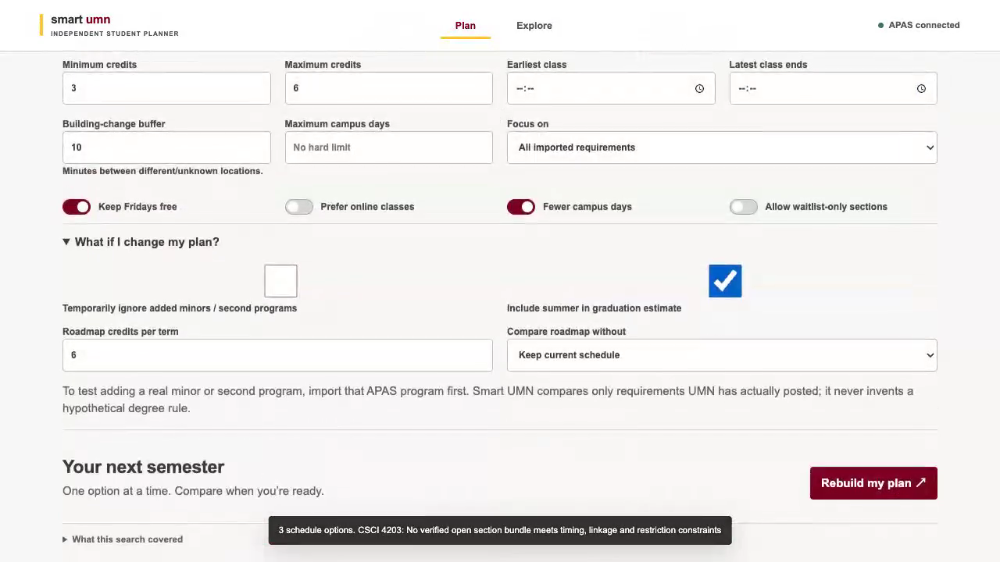
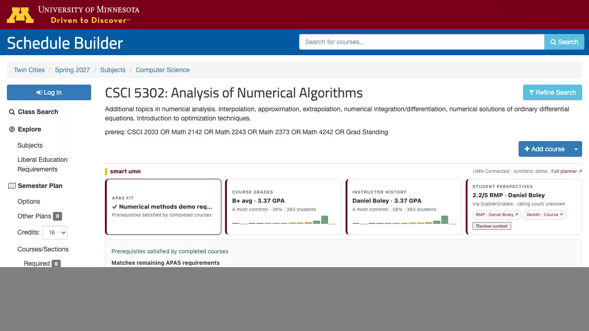

# Smart UMN v0.7.0 demos

All demo recordings use a synthetic academic profile plus public UMN course data. They do not contain raw APAS HTML, student identity, credentials, cookies, Duo/SAML material, or a real student's course history.

## 1. Plan → graduation roadmap → registration handoff

Shows a deterministic multi-term graduation horizon, evidence-backed future course placement, bottlenecks, a current generated schedule, and class-number handoff back to official UMN registration tools.

## 2. What-if graduation planning

Shows persistent planning controls for credit load, summer inclusion, program-scope changes, drop-course comparison, timing constraints, campus-day constraints, and waitlist opt-in.

## 3. Schedule Builder inline extension

Shows the current inline Smart UMN rail on a real Twin Cities Schedule Builder course page using a synthetic connected profile.

The machine-readable recording receipt is [`demos/demo-manifest.json`](demos/demo-manifest.json).
