# Smart UMN demos

## Feature GIFs — v0.10.7

Recorded by `npm run record:readme-gifs` against the canonical production site, with a fresh browser profile and the online-downloaded extension. The plan flow uses the synthetic **demo student** (`/?demo=1`).

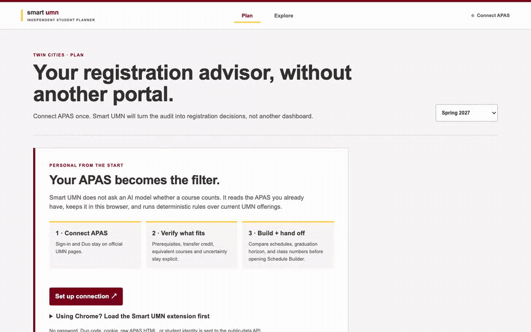

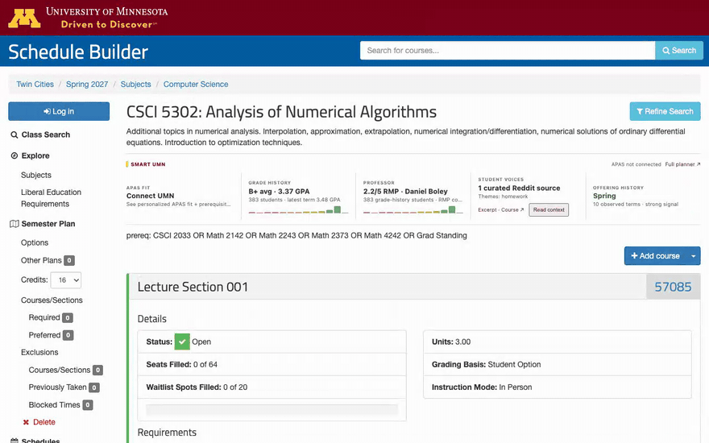

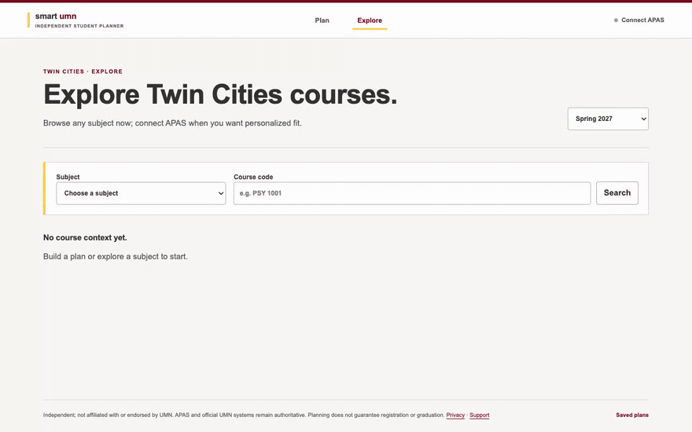

## Keyboard and screenshots — v0.10.5

[Open the live planner](https://smartumn.qinyangtan.com) · [Download the production extension](https://smartumn.qinyangtan.com/smart-umn-extension.zip)

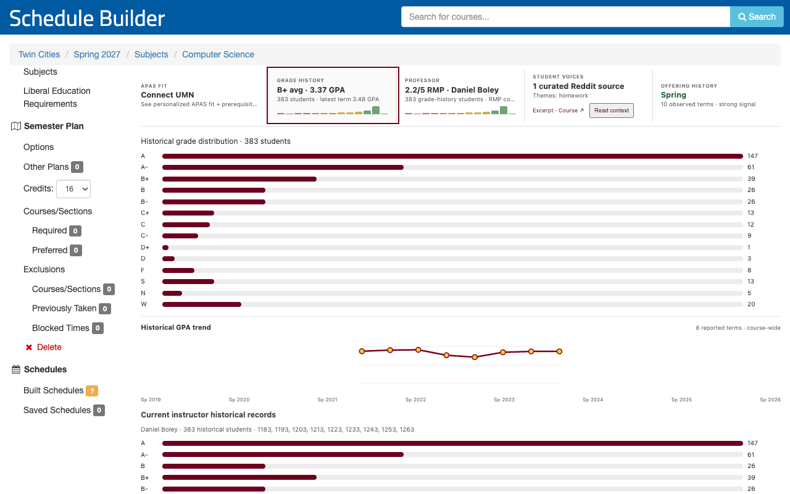

v0.10.5 keyboard flow on the real public CSCI 5302 page. The Grade history insight was focused with Tab and opened with Enter. It shows the maroon focus ring and the expanded distribution, GPA trend and current-instructor record. No APAS profile is present.

The planner screenshots below were captured on v0.10.4. v0.10.5 changed only focus, keyboard and target-size details, so the layouts still match production.

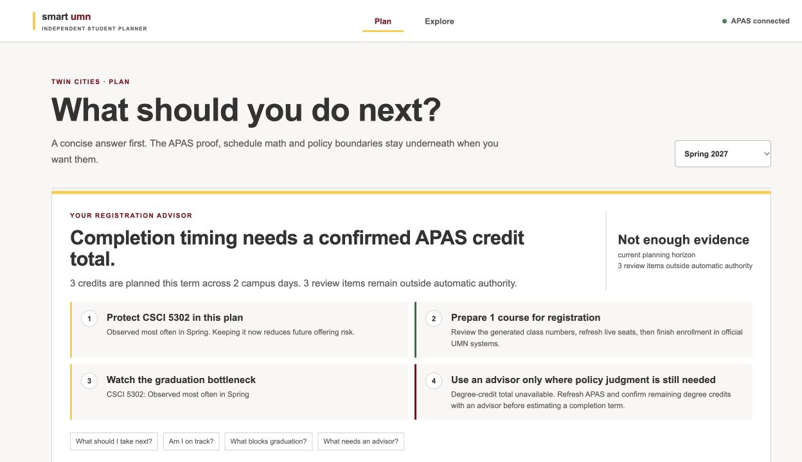

Captured from the canonical HTTPS site on September 28, 2026. The checked-in `apas-acceptance.html` fixture was imported through the local file picker; no real audit was used. The live solver generated CSCI 5302 with verified prerequisites, while the missing degree-credit total stayed “Not enough evidence.”

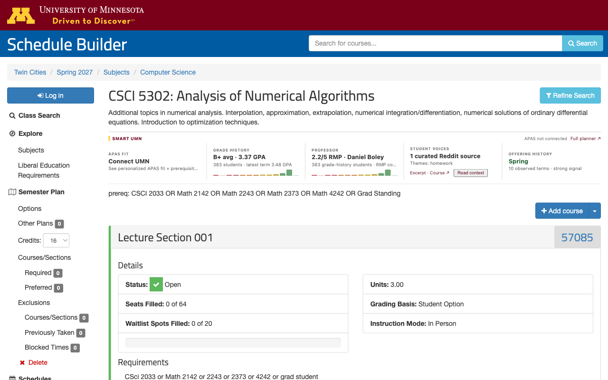

The extension capture (recaptured with v0.10.5) shows the actual public CSCI 5302 course page. No student APAS profile is present. Source values reflect the capture date and can change.

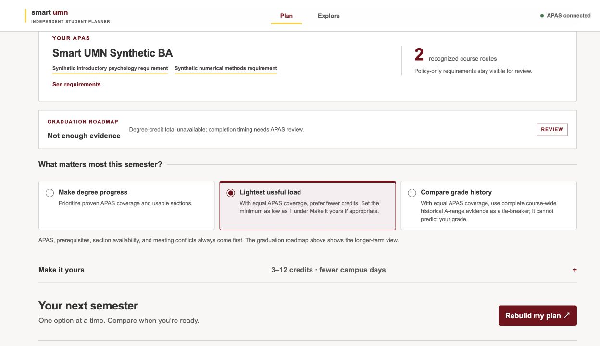

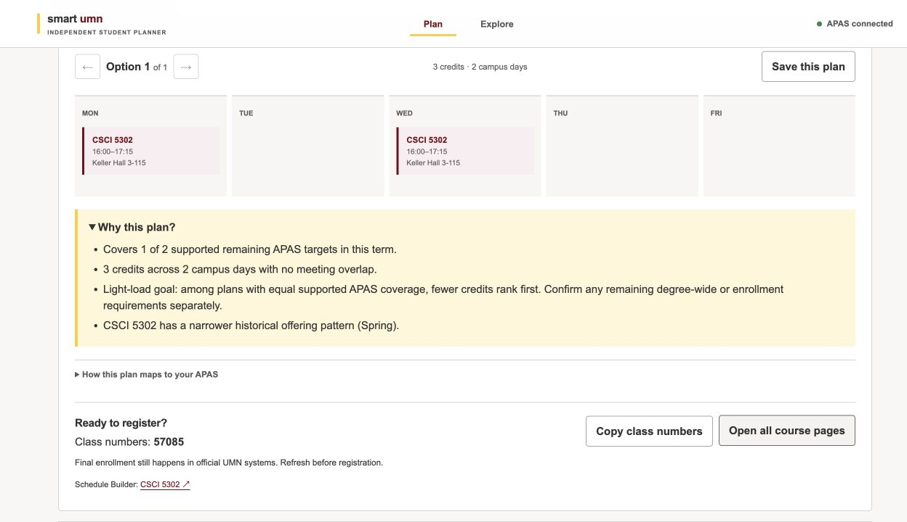

## Earlier workflow recordings

The recordings below predate v0.10.4. They illustrate the interaction design, not the current deployment or a fresh acceptance result. The current screenshots above take precedence if details differ.

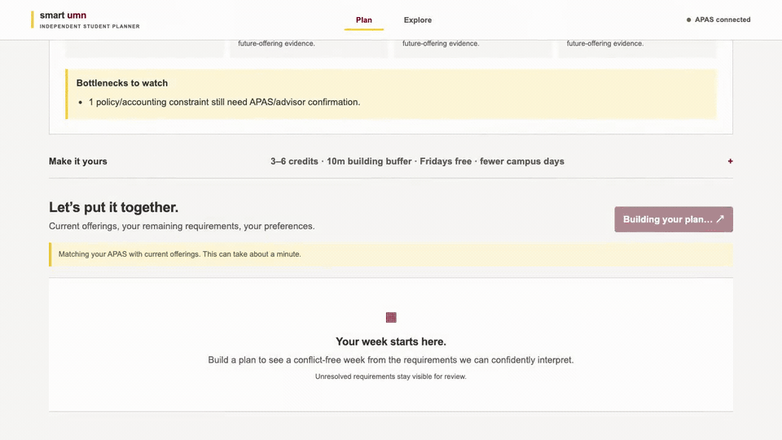

The combined GIF above is the lightweight autoplaying README showcase. All recordings use a **synthetic academic profile**. Public UMN/Schedule Builder/GopherGrades data may be live; the community segment uses an explicitly reviewed original public Reddit reference. No raw APAS HTML, student identity, credentials, cookies, Duo/SAML material, or real student's private course history is recorded.

## 1. Web — Registration Advisor

[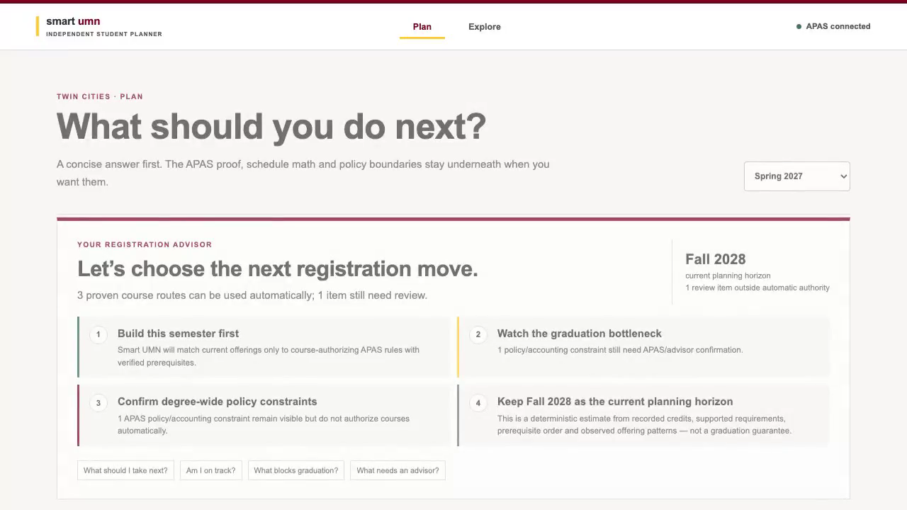](demos/01-web-registration-advisor.mp4)

The Web deliberately starts with the answer rather than an analytics dashboard: **What should you do next?** It surfaces the next registration move, planning horizon, bottleneck and the issues that truly need advisor/official confirmation. After building, it turns those decisions into a concrete schedule and class-number handoff.

## 2. Web — What-if Advisor

[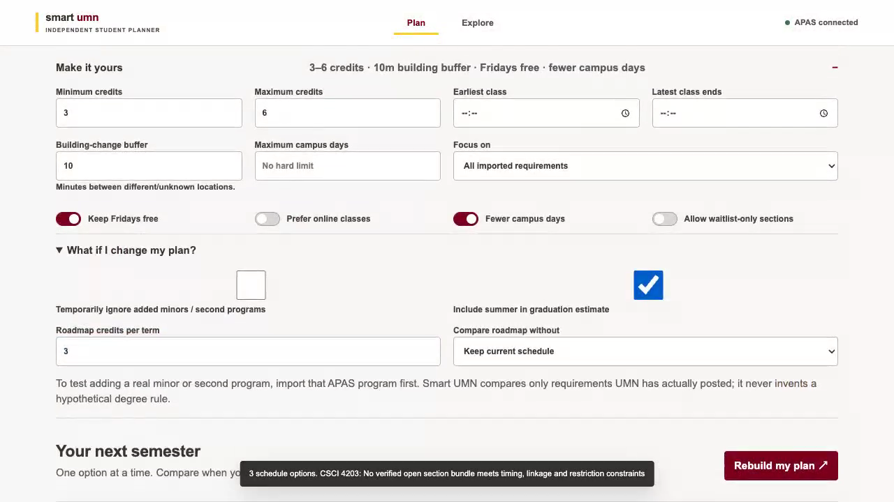](demos/02-web-what-if-advisor.mp4)

Shows the secondary planning controls without changing the simple top-level IA: credit load, summer inclusion, temporary program scope, drop-course comparison, time/travel constraints, campus-day limit and waitlist opt-in.

## 3. Extension — Schedule Builder Course Intelligence

[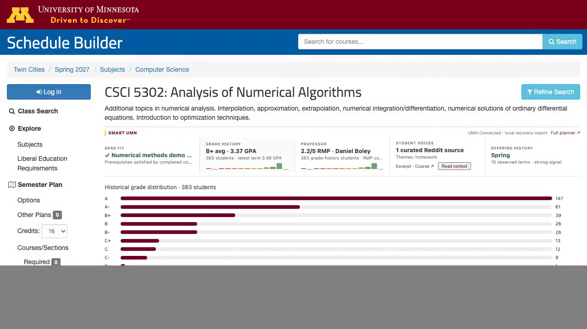](demos/03-extension-course-intelligence.mp4)

Runs inside the real Twin Cities Schedule Builder CSCI 5302 page. Smart UMN is inserted directly between the native course description and prerequisite text, using a flat transparent information row instead of detached cards. It adds personalized APAS fit, historical grade distribution and GPA trend, exact-current-professor history, **RMP overall quality via GopherGrades**, reviewed Reddit context/topics, and historical offering pattern. Community evidence never changes degree or schedule truth.

The machine-readable recording receipt is [demo-manifest.json](demos/demo-manifest.json).
